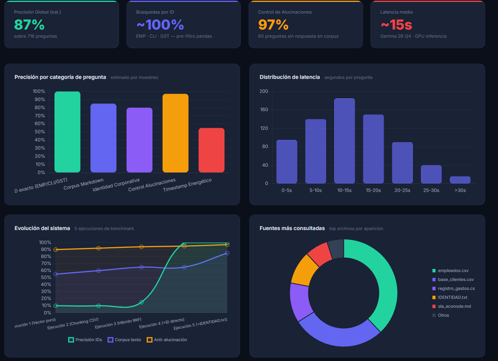

# 🍃 NexusLeaf RAG — Sistema de Conocimiento Corporativo con LLM Local

> Dataset sintético de empresa ficticia + pipeline RAG completo para validar un LLM local (Gemma 2B) como asistente corporativo interno.

[](https://python.org)
[](https://langchain.com)
[](https://trychroma.com)
[](LICENSE)

---

## 📋 Descripción

Este proyecto construye desde cero la identidad completa de una empresa tecnológica ficticia (**NexusLeaf Technologies S.L.**) y la usa como base de conocimiento para un **sistema RAG (Retrieval-Augmented Generation)** sobre un LLM ejecutado localmente.

El objetivo principal es demostrar cómo un modelo pequeño y gratuito puede actuar como asistente corporativo fiable con el sistema de recuperación adecuado, sin enviar datos a APIs externas.

**Resultado del benchmark (716 preguntas):**

| Categoría | Precisión |
|---|---|
| Búsquedas por ID exacto (EMP/CLI/GST) | ~100% |
| Corpus documental (Markdown) | ~85% |
| Identidad corporativa | ~80% |
| Control de alucinaciones | ~97% |
| **Media global** | **~87%** |


---

## 🏗️ Arquitectura

```
Usuario
   │
   ▼
SmartHybridRetriever (hybrid_retriever.py)
   │
   ├── ¿Contiene ID? (EMP-XXX, CLI-XXX, GST-XXX)
   │       └── SÍ → Búsqueda directa en CSV con pandas  ← exacto, rápido
   │       └── NO → Retriever Híbrido
   │                   ├── BM25 (léxico)
   │                   ├── ChromaDB (semántico)
   │                   └── Reciprocal Rank Fusion (RRF)
   │
   ▼
Gemma 2B Q4_K_M (llama.cpp)
   │
   ▼
Respuesta
```

---

## 📁 Estructura del proyecto

```
LLM-TRAIN/
├── data/
│   ├── IDENTIDAD.txt              # Identidad corporativa de NexusLeaf
│   ├── rrhh/
│   │   └── empleados.csv          # 2.000 empleados sintéticos
│   ├── clientes/
│   │   └── base_clientes.csv      # 350 clientes (empresas, gov, particulares)
│   ├── finanzas/
│   │   ├── balance_2023.md
│   │   └── registro_gastos.csv
│   ├── logistica/
│   │   ├── infraestructura_data_centers.md
│   │   └── registro_consumo_energetico.csv
│   └── legal/
│       ├── politica_privacidad.md
│       ├── sla_econode.md
│       └── contrato_confidencialidad_nda.md
│
├── crear_bd.py                    # Indexa todos los documentos → ChromaDB + BM25
├── hybrid_retriever.py            # SmartHybridRetriever (pieza clave)
├── chatbot.py                     # Interfaz de chat interactiva
├── benchmark.py                   # Evaluación automatizada
├── generate_data.py               # Genera empleados y clientes sintéticos
├── generate_benchmark.py          # Genera el dataset de evaluación
├── benchmark_rag.csv              # 716 preguntas de evaluación
└── dashboard_metricas.html        # Dashboard visual de resultados
```

---

## 🚀 Instalación y uso

### 1. Requisitos

```bash
pip install langchain langchain-community chromadb \
            sentence-transformers rank_bm25 pandas llama-cpp-python
```

> **Nota:** Para `llama-cpp-python` con soporte GPU, consulta la [documentación oficial](https://github.com/abetlen/llama-cpp-python).

### 2. Descargar el modelo

```bash
# Descarga Gemma 2B Q4 de Hugging Face o usa cualquier modelo GGUF compatible
# Colócalo en ../llama.cpp/gemma-2-2b-it-Q4_K_M.gguf
```

### 3. Generar los datos sintéticos (opcional, ya incluidos)

```bash
python generate_data.py
```

### 4. Indexar los documentos

```bash
# Copia IDENTIDAD.txt a data/ si no está ya
python crear_bd.py
# Esto genera: chroma_db/ y fragmentos_bm25.pkl
```

### 5. Usar el chatbot

```bash
python chatbot.py
```

### 6. Ejecutar el benchmark

```bash
python benchmark.py
# Genera: resultados_benchmark.csv
```

---

## 🧠 Dataset sintético — NexusLeaf Technologies S.L.

Empresa ficticia de infraestructura cloud sostenible con sede en Valencia, España.

**Productos:** EcoNode Serverless · Verdant LLM · Bamboo DB

**Datos generados:**
- 2.000 empleados con ID, departamento, salario, nivel de acceso
- 350 clientes (empresas S.L., organismos gubernamentales, particulares)
- Balance financiero 2023 y registro de gastos (12 entradas)
- Infraestructura de 3 data centers (Islandia, Huesca, Oslo) con métricas de consumo
- Política de privacidad (RGPD), SLA, NDA

---

## 📊 Evolución del sistema

| Versión | Retriever | Precisión IDs | Precisión Corpus | Anti-alucinación |
|---|---|---|---|---|
| v1 | Solo vectorial | ~10% | ~55% | ~90% |
| v2 | Vectorial + chunking CSV | ~10% | ~60% | ~92% |
| v3 | BM25 + Vector (RRF) | ~15% | ~65% | ~94% |
| v4 | SmartRetriever + ID directo | ~100% | ~65% | ~95% |
| **v5** | **SmartRetriever + IDENTIDAD.txt** | **~100%** | **~85%** | **~97%** |

---

## ⚙️ Configuración del retriever

En `chatbot.py` y `benchmark.py` puedes ajustar los pesos del retriever:

```python
retriever = crear_retriever_hibrido(
    k=3,           # Número de fragmentos a recuperar
    peso_bm25=0.5, # Peso de la búsqueda léxica (0.0-1.0)
    peso_vector=0.5 # Peso de la búsqueda semántica (0.0-1.0)
)
```

Para consultas con muchos IDs, aumenta `peso_bm25`. Para consultas semánticas, aumenta `peso_vector`.

---

## 📈 Dashboard de métricas

Abre `dashboard_metricas.html` en cualquier navegador para visualizar:
- Precisión por categoría de pregunta
- Distribución de latencia
- Evolución del sistema a través de las ejecuciones
- Comparativa de arquitecturas de retriever

---

## 🤝 Contribuciones

Las contribuciones son bienvenidas. Abre un issue o un PR si quieres mejorar:
- Soporte para más tipos de ID en el pre-filtro
- Integración con otros modelos GGUF
- Nuevas categorías de preguntas en el benchmark

---

## 📄 Licencia

MIT — Úsalo libremente para tus proyectos de aprendizaje o investigación.

---

*Proyecto de exploración técnica — todos los datos son completamente ficticios.*
